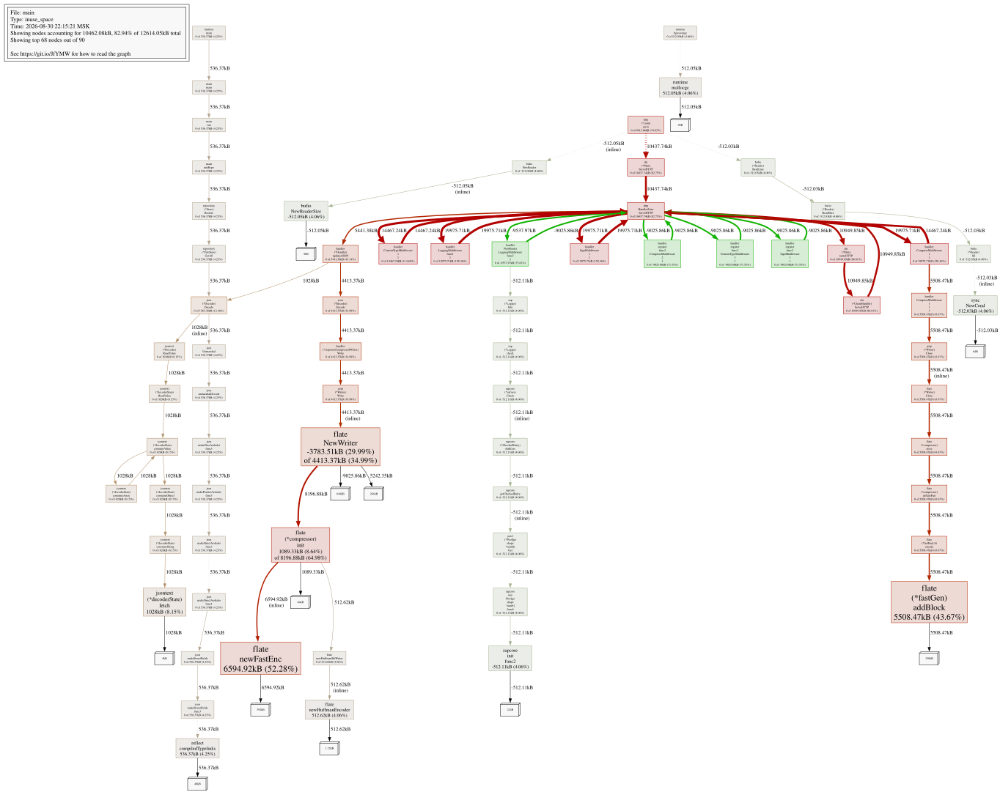

# go-musthave-metrics-tpl

Шаблон репозитория для трека «Сервер сбора метрик и алертинга».

## Начало работы

1. Склонируйте репозиторий в любую подходящую директорию на вашем компьютере.
2. В корне репозитория выполните команду `go mod init <name>` (где `<name>` — адрес вашего репозитория на GitHub без префикса `https://`) для создания модуля.

## Обновление шаблона

Чтобы иметь возможность получать обновления автотестов и других частей шаблона, выполните команду:

```
git remote add -m v2 template https://github.com/Yandex-Practicum/go-musthave-metrics-tpl.git
```

Для обновления кода автотестов выполните команду:

```
git fetch template && git checkout template/v2 .github
```

Затем добавьте полученные изменения в свой репозиторий.

## Запуск автотестов

Для успешного запуска автотестов называйте ветки `iter<number>`, где `<number>` — порядковый номер инкремента. Например, в ветке с названием `iter4` запустятся автотесты для инкрементов с первого по четвёртый.

При мёрже ветки с инкрементом в основную ветку `main` будут запускаться все автотесты.

Подробнее про локальный и автоматический запуск читайте в [README автотестов](https://github.com/Yandex-Practicum/go-autotests).

## Структура проекта

Приведённая в этом репозитории структура проекта является рекомендуемой, но не обязательной.

Это лишь пример организации кода, который поможет вам в реализации сервиса.

При необходимости можно вносить изменения в структуру проекта, использовать любые библиотеки и предпочитаемые структурные паттерны организации кода приложения, например:
- **DDD** (Domain-Driven Design)
- **Clean Architecture**
- **Hexagonal Architecture**
- **Layered Architecture**

## Профилирование памяти (Спринт 6)

Сервер нагрузил с помощью `hey` — отправлял батч из 29 метрик, заранее сгенеророванных, на POST /updates, как это делает агент. профиль снял через pprof, сохранил в `profiles/base.pprof`.

### Находка №1

`gzip.Writer` создаётся заново на каждый HTTP-запрос. Это 71.55% (9025.86kB) всей памяти в профиле — проверил через `top`, `list`, `peek` и граф `web`

Место: [internal/handler/middleware.go](internal/handler/middleware.go), функция `responseCompressedWriter.checkContentType()` — там вызывается `gzip.NewWriter()` на каждый запрос.

### Находка №2

В [internal/service/metricsservice.go](internal/service/metricsservice.go), в `UpdateMetrics`, строка `mm := metrics[i]`, а потом `toSave = append(toSave, &mm)` — из-за этого каждая метрика в батче лишний раз убегает в кучу. Проверил через `BenchmarkUpdateMetrics` — аллокации растут примерно 1:1 с размером батча

### Что буду чинить

- переиспользовать `gzip.Writer` через `sync.Pool` вместо создания нового на каждый запрос;
- убрать лишнюю копию структуры в цикле `UpdateMetrics` — брать адрес прямо из элемента слайса, без локальной копии.

### До/после

Обе находки починил: `gzip.Writer` теперь переиспользуется через `sync.Pool` (находка №1), а в `MemStore.save` убрал мутацию чужого указателя `Delta` — заодно нашёл и убрал ту самую лишнюю копию в куче в `UpdateMetrics` (находка №2 плюс баг, который она провоцировала).

Прогнал тот же нагрузочный тест (`hey`, тот же батч из 29 метрик, 45 секунд, та же конкурентность), снял профиль в `profiles/result.pprof`.

Throughput вырос: было ~14 790 req/s, стало ~56 852 req/s (почти х4), все 1 000 000 запросов всё так же 200 OK.

Запустил `go tool pprof -top -diff_base=profiles/base.pprof profiles/result.pprof`. Та самая строка с созданием `gzip.Writer` из находки №1 теперь в отрицательных числах — она пропала из профиля.

Картина не «всё резко ушло в минус»: некоторые записи, связанные с `flate` (например `flate.newFastEnc`, `fastGen.addBlock`), наоборот выросли в плюс. Причина: heap-профиль в режиме `inuse_space` показывает не сколько всего было выделено, а что живо в памяти прямо сейчас, в момент снятия снимка. `sync.Pool` специально держит несколько `gzip.Writer` живыми между запросами, чтобы их переиспользовать. То есть вместо кучи коротких аллокаций теперь меньше объектов, но они живут дольше — это и есть улучшение (GC ощутимо меньше нагружен, поэтому throughput и вырос почти в 4 раза). 

Итог: строка, на которую указывала находка №1 (создание нового writer'а на каждый запрос), однозначно ушла в минус. Смешанный плюс/минус в остальных местах — ожидаемое следствие того, как `sync.Pool` меняет «много коротких аллокаций» на «мало долгоживущих переиспользуемых» — а не признак того, что что-то не получилось.

Визуальный diff уже лежит в `profiles/diff_graph.svg`:




```
File: main
Type: inuse_space
Time: 2026-08-30 22:15:21 MSK
Showing nodes accounting for 10462.08kB, 82.94% of 12614.05kB total
      flat  flat%   sum%        cum   cum%
 6594.92kB 52.28% 52.28%  6594.92kB 52.28%  compress/flate.newFastEnc (inline)
 5508.47kB 43.67% 95.95%  5508.47kB 43.67%  compress/flate.(*fastGen).addBlock
-3783.51kB 29.99% 65.96%  4413.37kB 34.99%  compress/flate.NewWriter (inline)
 1089.33kB  8.64% 74.59%  8196.88kB 64.98%  compress/flate.(*compressor).init
    1028kB  8.15% 82.74%     1028kB  8.15%  encoding/json/jsontext.(*decoderState).fetch
  536.37kB  4.25% 87.00%   536.37kB  4.25%  reflect.compiledTypelinks
  512.62kB  4.06% 91.06%   512.62kB  4.06%  compress/flate.newHuffmanEncoder (inline)
 -512.11kB  4.06% 87.00%  -512.11kB  4.06%  go.uber.org/zap/zapcore.init.func2
 -512.05kB  4.06% 82.94%  -512.05kB  4.06%  bufio.NewReaderSize (inline)
  512.05kB  4.06% 87.00%   512.05kB  4.06%  runtime.mallocgc
 -512.03kB  4.06% 82.94%  -512.03kB  4.06%  sync.NewCond (inline)
         0     0% 82.94%  -512.03kB  4.06%  bufio.(*Reader).ReadLine
         0     0% 82.94%  -512.03kB  4.06%  bufio.(*Reader).ReadSlice
         0     0% 82.94%  -512.03kB  4.06%  bufio.(*Reader).fill
         0     0% 82.94%  -512.05kB  4.06%  bufio.NewReader (inline)
         0     0% 82.94%  5508.47kB 43.67%  compress/flate.(*Writer).Close (inline)
         0     0% 82.94%  5508.47kB 43.67%  compress/flate.(*compressor).close
         0     0% 82.94%  5508.47kB 43.67%  compress/flate.(*compressor).deflateFast
         0     0% 82.94%  5508.47kB 43.67%  compress/flate.(*fastEncL6).encode
         0     0% 82.94%   512.62kB  4.06%  compress/flate.newHuffmanBitWriter
         0     0% 82.94%  5508.47kB 43.67%  compress/gzip.(*Writer).Close
         0     0% 82.94%  4413.37kB 34.99%  compress/gzip.(*Writer).Write
         0     0% 82.94%  1564.38kB 12.40%  encoding/json.(*Decoder).Decode
         0     0% 82.94%  4413.37kB 34.99%  encoding/json.(*Encoder).Encode
         0     0% 82.94%     1028kB  8.15%  encoding/json/jsontext.(*Decoder).ReadValue (inline)
         0     0% 82.94%     1028kB  8.15%  encoding/json/jsontext.(*decoderState).ReadValue
         0     0% 82.94%     1028kB  8.15%  encoding/json/jsontext.(*decoderState).consumeArray
         0     0% 82.94%     1028kB  8.15%  encoding/json/jsontext.(*decoderState).consumeObject
         0     0% 82.94%     1028kB  8.15%  encoding/json/jsontext.(*decoderState).consumeString
         0     0% 82.94%     1028kB  8.15%  encoding/json/jsontext.(*decoderState).consumeValue
         0     0% 82.94%   536.37kB  4.25%  encoding/json/v2.Unmarshal
         0     0% 82.94%   536.37kB  4.25%  encoding/json/v2.makePointerArshaler.func3
         0     0% 82.94%   536.37kB  4.25%  encoding/json/v2.makeSliceArshaler.func3
         0     0% 82.94%   536.37kB  4.25%  encoding/json/v2.makeStructArshaler.func1
         0     0% 82.94%   536.37kB  4.25%  encoding/json/v2.makeStructArshaler.func3
         0     0% 82.94%   536.37kB  4.25%  encoding/json/v2.makeStructFields
         0     0% 82.94%   536.37kB  4.25%  encoding/json/v2.makeStructFields.func3
         0     0% 82.94%   536.37kB  4.25%  encoding/json/v2.unmarshalDecode
         0     0% 82.94%  5441.38kB 43.14%  github.com/AVZotov/metrics/internal/handler.(*Handler).updatesJSON
         0     0% 82.94%  4413.37kB 34.99%  github.com/AVZotov/metrics/internal/handler.(*responseCompressedWriter).Write
         0     0% 82.94% 19975.71kB 158.36%  github.com/AVZotov/metrics/internal/handler.CompressMiddleware.1.1
         0     0% 82.94%  5508.47kB 43.67%  github.com/AVZotov/metrics/internal/handler.CompressMiddleware.1.1.1
         0     0% 82.94% 14467.24kB 114.69%  github.com/AVZotov/metrics/internal/handler.ContentTypeMiddleware.1.1
         0     0% 82.94% 19975.71kB 158.36%  github.com/AVZotov/metrics/internal/handler.LoggingMiddleware.func1.1
         0     0% 82.94% -9537.97kB 75.61%  github.com/AVZotov/metrics/internal/handler.NewRouter.LoggingMiddleware.func2.1
         0     0% 82.94% 19975.71kB 158.36%  github.com/AVZotov/metrics/internal/handler.SignMiddleware.1.1
         0     0% 82.94% -9025.86kB 71.55%  github.com/AVZotov/metrics/internal/handler.register.func2.CompressMiddleware.2.1
         0     0% 82.94% -9025.86kB 71.55%  github.com/AVZotov/metrics/internal/handler.register.func2.ContentTypeMiddleware.3.1
         0     0% 82.94% -9025.86kB 71.55%  github.com/AVZotov/metrics/internal/handler.register.func2.SignMiddleware.1.1
         0     0% 82.94%   536.37kB  4.25%  github.com/AVZotov/metrics/internal/repository.(*FileStore).GetAll
         0     0% 82.94%   536.37kB  4.25%  github.com/AVZotov/metrics/internal/repository.(*Store).Restore
         0     0% 82.94% 10949.85kB 86.81%  github.com/go-chi/chi/v5.(*ChainHandler).ServeHTTP
         0     0% 82.94% 10437.74kB 82.75%  github.com/go-chi/chi/v5.(*Mux).ServeHTTP
         0     0% 82.94% 10949.85kB 86.81%  github.com/go-chi/chi/v5.(*Mux).routeHTTP
         0     0% 82.94%  -512.11kB  4.06%  go.uber.org/zap.(*Logger).Info
         0     0% 82.94%  -512.11kB  4.06%  go.uber.org/zap.(*Logger).check
         0     0% 82.94%  -512.11kB  4.06%  go.uber.org/zap/internal/pool.(*Pool[go.shape.*uint8]).Get (inline)
         0     0% 82.94%  -512.11kB  4.06%  go.uber.org/zap/zapcore.(*CheckedEntry).AddCore (inline)
         0     0% 82.94%  -512.11kB  4.06%  go.uber.org/zap/zapcore.(*ioCore).Check
         0     0% 82.94%  -512.11kB  4.06%  go.uber.org/zap/zapcore.getCheckedEntry
         0     0% 82.94%  -512.11kB  4.06%  go.uber.org/zap/zapcore.init.New[go.shape.*uint8].func6
         0     0% 82.94%   536.37kB  4.25%  main.initRepo
         0     0% 82.94%   536.37kB  4.25%  main.main
         0     0% 82.94%   536.37kB  4.25%  main.run
         0     0% 82.94%  -512.03kB  4.06%  net/http.(*conn).readRequest
         0     0% 82.94%  9413.66kB 74.63%  net/http.(*conn).serve
         0     0% 82.94%  -512.03kB  4.06%  net/http.(*connReader).Read
         0     0% 82.94%  -512.03kB  4.06%  net/http.(*connReader).lock
         0     0% 82.94% 10437.74kB 82.75%  net/http.HandlerFunc.ServeHTTP
         0     0% 82.94%  -512.05kB  4.06%  net/http.newBufioReader
         0     0% 82.94%  -512.03kB  4.06%  net/http.readRequest
         0     0% 82.94% 10437.74kB 82.75%  net/http.serverHandler.ServeHTTP
         0     0% 82.94%  -512.03kB  4.06%  net/textproto.(*Reader).ReadLine (inline)
         0     0% 82.94%  -512.03kB  4.06%  net/textproto.(*Reader).readLineSlice
         0     0% 82.94%   536.37kB  4.25%  reflect.(*rtype).ptrTo
         0     0% 82.94%   536.37kB  4.25%  reflect.PointerTo (inline)
         0     0% 82.94%   536.37kB  4.25%  reflect.typesByString
         0     0% 82.94%   512.05kB  4.06%  runtime.(*scavengerState).init
         0     0% 82.94%   512.05kB  4.06%  runtime.bgscavenge
         0     0% 82.94%      513kB  4.07%  runtime.handoffp
         0     0% 82.94%   536.37kB  4.25%  runtime.main
         0     0% 82.94%   512.05kB  4.06%  runtime.newobject
         0     0% 82.94%     -513kB  4.07%  runtime.resetspinning
         0     0% 82.94%      513kB  4.07%  runtime.retake
         0     0% 82.94%     -513kB  4.07%  runtime.schedule
         0     0% 82.94%      513kB  4.07%  runtime.sysmon
         0     0% 82.94%     -513kB  4.07%  runtime.wakep
         0     0% 82.94%   536.37kB  4.25%  sync.(*Once).Do
         0     0% 82.94%   536.37kB  4.25%  sync.(*Once).doSlow
         0     0% 82.94%  -512.11kB  4.06%  sync.(*Pool).Get
```

Граф вызовов лежит в `profiles/base_graph.svg`.
